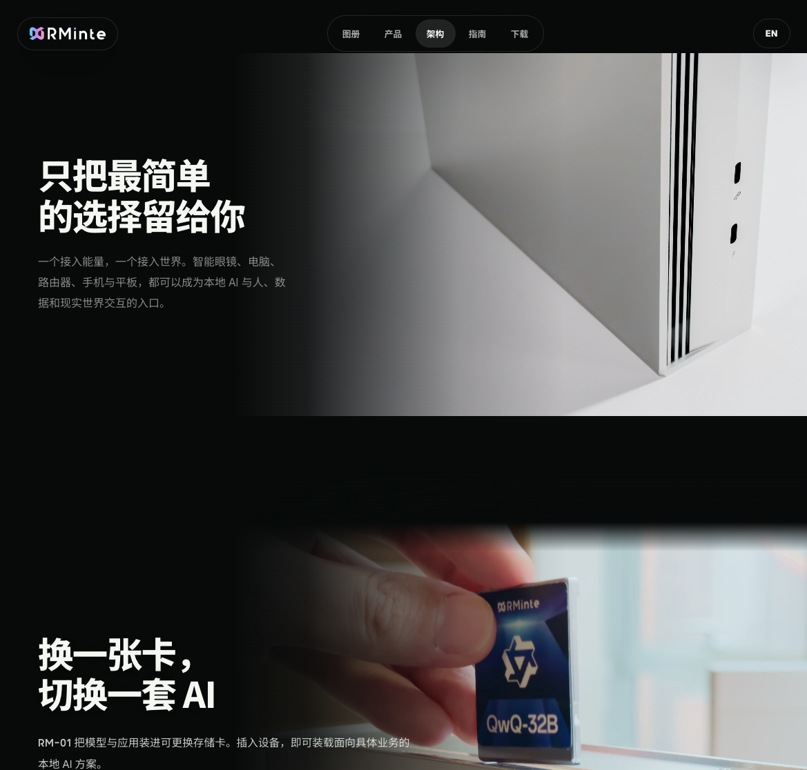

# RM-01 网站改版交接

## 范围

本分支包含此前未合并的网站架构重构、旧版页面/素材清理，以及本轮视觉和交互调整。审核应以相对上游 main 的完整差异为准，而不只看最后一次提交。

- 导航统一：品牌标识进入首页，产品进入自研推理引擎，架构进入硬件结构动态分解；图册、指南、下载页保持相同目标。
- 产品叙事顺序：推理引擎、TianshanOS、应用与推理等模组、结构拆解，再进入材料与硬件细节。
- 主标题统一大/小两档响应式字号，统一板块留白，删除重复的摘要标签。
- 蓝宝石局部遮罩随滚动提亮；拆解和工艺展示保留滚动驱动；插卡视频持续循环，不再切黑后显示静态卡图。
- 接口图片采用横向构图、上下硬切、文字侧渐变；保留接口与金属边缘细节。

## 素材处理

- 图册原图不覆盖。`assets/images/ports-rec709-gamma24-sdr.jpg` 为 DSC0031.jpg 的派生版本，3000×2000。
- 源 JPEG 的 ICC 为 Display P3，包含 Adobe HDR 增益图，BaseRenditionIsHDR=False；不是直接将文件当作 HLG 解码。派生图使用 SDR 基础图，转换为 D65 / Rec.709 原色、Gamma 2.4 的 ICC，并移除 HDR 增益元数据。
- 高光曲线在线性域保留 0–0.65，以上使用 `0.65 + 0.35 * (1 - exp(-(x - 0.65) / 0.35))` 压缩，再编码为 Gamma 2.4。转换不重绘产品结构。
- `cartridge-tvc-v2.mp4` 为用户提供的新插卡视频的网页版本；保留自然色彩，不使用全画面压暗/去饱和滤镜。
- `thermal-airflow-loop-hd.mp4` 为当前使用的散热视频。原始 MOV、已废弃的插卡版本、过程截图与构图试验不随本次新增提交发布。
- 素材由产品方提供或在此前设计流程中产生；本次未做第三方授权审计，上游发布前仍需确认素材和字体授权。

## 验证与边界

桌面最终构图示例（接口与插卡相邻板块）：

- 本地预览：以 `rm01-website-soft` 为静态根目录，例如 `python3 -m http.server 4174 --directory rm01-website-soft`。
- 已在 Chromium 浏览器检查导航、图文构图、视频循环及两档标题字号；覆盖 1169px 桌面、1920px 字号检查与 390px 手机布局检查。
- 已检查 JavaScript 语法和 Git 空白错误。浏览器验证为人工/脚本交互记录，不是完整自动化回归套件。
- Safari 曾反馈叶片初始清晰后变模糊：已去除特写的 transform 放大与外层 reveal，改为实际尺寸定位。尚未在用户 Safari 上完成最终回归，不宣称已跨浏览器验收。
- 上游合并前建议重点复验：Safari 原图色彩与叶片清晰度、蓝宝石双向滚动提亮、拆解/工艺滚动行程、中英文换行、图册/下载/指南到三个主导航目标的跳转。

## 部署

沿用上游现有部署，不修改域名、端口或密钥。网站静态目录为 `rm01-website-soft`；Cloudflare Pages 的 `_worker.js` / `_routes.json` 提供访问地区默认语言，普通静态预览不模拟该接口。OTA 服务仍为独立目录 `services/tianshanos-ota`，本 PR 不要求重部署 OTA。

本地 `output/`、浏览器截图和 `craft-concepts/` 是过程资料，不属于生产网站。回退应针对上游合并产生的提交进行，不要在现场覆盖或删除图册原文件。
